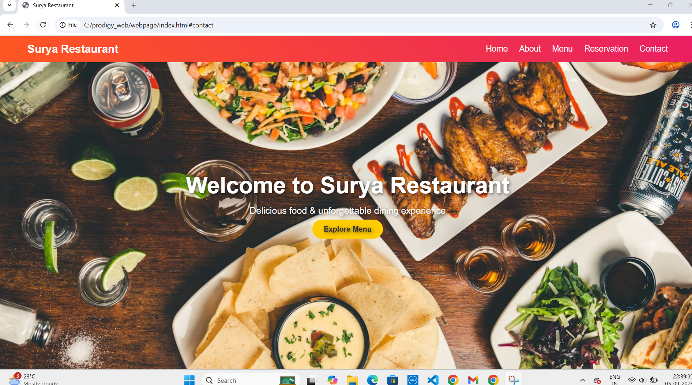

# PRODIGY_WD_01 - Interactive Navigation Menu  

This project is part of my **Web Development Internship at Prodigy InfoTech**.  
It showcases an **interactive navigation menu** built using **HTML, CSS, and JavaScript** with hover and scroll effects.  

## 🚀 Features  
- 📌 **Fixed Position**: The navigation bar stays visible on all pages.  
- 🎨 **Hover Effects**: Menu items change color/style on hover for better UI.  
- 📜 **Scroll Effect**: Background and font colors dynamically change when scrolling.  
- 📱 **Responsive Design**: Works smoothly on different screen sizes.  

## 💡 Learning Outcomes  
Through this task, I:  
- Gained hands-on experience in combining **HTML (structure)**, **CSS (styling)**, and **JavaScript (interactivity)**.  
- Learned how to make websites more **user-friendly and engaging** with hover and scroll effects.  
- Improved my **front-end development** and **UI/UX design** skills.  

## 📂 Project Structure  
PRODIGY_WD_01/

│── index.html      
│── style.css        
│── script.js        
│── README.md       
│── screenshot.png   

## 📸 Demo Preview  

### 🏠 Homepage  
  

### ℹ️ About Page  
  

### 📞 Contact Page  
  
